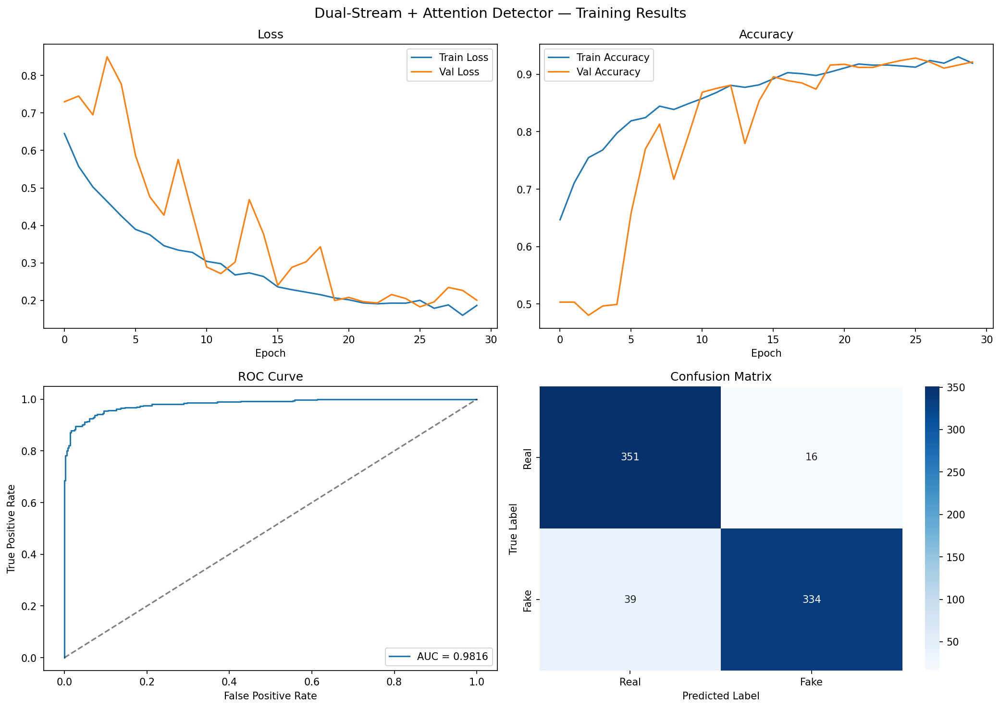
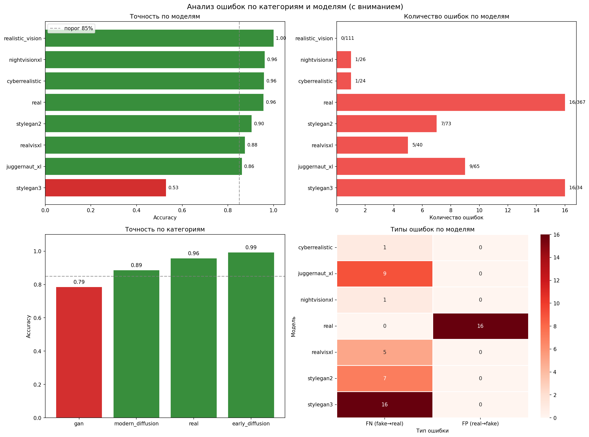

# Deepfake Detector API

Микросервис на FastAPI для детекции дипфейков на основе модели Dual-Stream + Attention (EfficientNetB0 + FFT + Cross-Attention).

**Метрики:** Accuracy 92.6% · AUC-ROC 98.2% · F1 92.4%

---

## Структура проекта

```
deepfake_service/
├── main.py
├── requirements.txt
├── Dockerfile
├── best_model_attention.keras
├── normalization_params.txt
├── training/
│ ├── fft_transform.py
│ ├── train.py
│ ├── analyze_by_category.py
│ ├── training_results.png
│ └── analysis_by_category.png
└── README.md
```

---

## Запуск

### Локально
```bash
pip install -r requirements.txt
uvicorn main:app --reload --port 8000
```

### Docker
```bash
docker build -t deepfake-detector .
docker run -p 8000:8000 deepfake-detector
```

---

## Эндпоинты

### `GET /health`
```json
{"status": "OK"}
```

### `POST /predict`

| Поле    | Тип  | Описание              |
|---------|------|-----------------------|
| `image` | файл | Фото лица (jpg / png) |

```json
{
  "label": "real",
  "fake_probability": 0.0209,
  "real_probability": 0.9791,
  "threshold": 0.5
}
```

---

## Примеры запросов

**curl**
```bash
curl http://localhost:8000/health

curl -X POST http://localhost:8000/predict \
  -F "image=@face.jpg"
```

**Python**
```python
import requests

resp = requests.post(
    "http://localhost:8000/predict",
    files={"image": open("face.jpg", "rb")},
)
print(resp.json())
```

---

## Датасет

Датасет собран вручную, включает 4 927 изображений лиц, сбалансирован по классам:

| Класс | Количество | Доля |
|---|---|---|
| Синтетические (fake) | 2 483 | 50.4% |
| Реальные (real) | 2 444 | 49.6% |
| **Итого** | **4 927** | **100%** |

**Синтетический класс** — 7 генеративных моделей трёх поколений (GAN, Stable Diffusion 1.5, SDXL):

| Поколение | Модель | Количество | Источник |
|---|---|---|---|
| GAN | StyleGAN2 | 583 | Fake-Vs-Real-Faces |
| GAN | StyleGAN3 | 249 | StyleGAN3 Synthetic Face Image Dataset |
| SD 1.5 | Realistic Vision | 694 | ComfyUI |
| SD 1.5 | CyberRealistic | 132 | ComfyUI |
| SDXL | Juggernaut XL | 392 | Fooocus |
| SDXL | NightVision XL | 183 | Fooocus |
| SDXL | RealVisXL | 250 | Fooocus |

Изображения GAN-архитектур взяты из открытых датасетов; изображения диффузионных моделей сгенерированы локально (SD 1.5 — ComfyUI, SDXL — Fooocus) по структурированным промптам с разнообразием по возрасту, этнической принадлежности, типу волос, освещению и углу съёмки.

**Реальный класс** — два открытых источника: FFHQ (Flickr-Faces-HQ, 2 000 изображений) и Fake-Vs-Real-Faces (реальные фото с Unsplash, 444 изображения).

**Предобработка:** исключено 73 изображения (1.5%) — без детектируемого лица, с артефактами генерации, дубликаты и повреждённые файлы. Разбивка train/val/test — 70/15/15, стратифицированная, `SEED=42` для воспроизводимости.

> Датасет не включён в репозиторий из-за лицензионных ограничений источников (FFHQ, Fake-Vs-Real-Faces, StyleGAN3 Synthetic Face Image Dataset). В `training/` — только скрипты обработки и обучения; для запуска нужно собрать датасет самостоятельно по структуре, описанной выше.

---

## Обучение и анализ модели

Полный пайплайн от подготовки данных до анализа ошибок:

| Скрипт | Назначение |
|---|---|
| `training/fft_transform.py` | Вычисление FFT-спектров изображений, глобальная нормализация по датасету |
| `training/train.py` | Обучение Dual-Stream архитектуры (EfficientNetB0 + SE-блоки + CBAM + Cross-Attention), stratified train/val/test split, оценка на тесте |
| `training/analyze_by_category.py` | Анализ ошибок модели в разрезе категорий данных и моделей-генераторов дипфейков: accuracy, распределение False Positive / False Negative |

**Запуск:**
```bash
python training/fft_transform.py --dataset_root <путь> --fft_root <путь> --csv_path <путь>
python training/train.py --dataset_root <путь> --fft_root <путь> --csv_path <путь> --results_dir <путь>
python training/analyze_by_category.py --model_path <путь_к_модели> --results_dir <путь>
```

**Результаты обучения:**



**Анализ ошибок по категориям и моделям-генераторам:**



---

## Swagger

```
http://localhost:8000/docs
```
